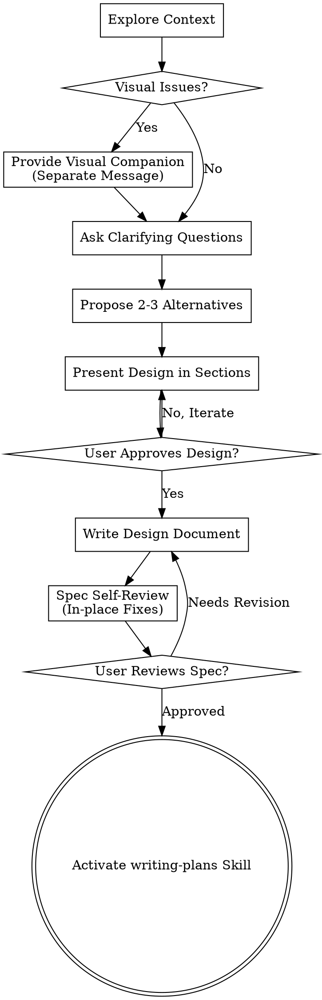

# Brainstorming Ideas Into Designs: Deep Guide to Product Definition

Transform vague product ideas into logically rigorous, validated design solutions and specifications through natural collaborative dialogue.

First understand the current project context, then ask one question at a time to refine the idea. Once what needs to be built is understood, present the design and obtain user approval.

<HARD-GATE>
Do not invoke any implementation skills, write any code, generate any PRDs, or take any implementation actions before presenting the design and obtaining user approval. This applies to every project, regardless of its perceived simplicity.
</HARD-GATE>

## Anti-Pattern: "This is too simple to need a design"

Every project goes through this process. A simple login box optimization, a configuration change, or even a copy update — all of them. "Simple" projects are often where unvetted assumptions lead to the most wasted work. Designs can be short (just a few sentences for truly simple projects), but you must present and obtain approval.

## Checklist

You must create a task for each of the following items and complete them in order:

1. **Explore Project Context** — Check discovery documents (`docs/pmpowers/discovery/`), historical experiment records, current North Star Metrics, and recent changelogs.
2. **Provide Visual Companion** (if the topic involves visual issues) — This is a separate message. Refer to the "Visual Companion" section below.
3. **Ask Clarifying Questions** — One at a time, to deeply understand the purpose, constraints, and success metrics (VDD).
4. **Propose 2-3 Alternatives** — Including trade-offs, cost assessments, and your expert recommendations.
5. **Present Design Sections** — Present in sections based on complexity, covering business logic, user paths, metric alignment, and risk mitigation.
6. **Write Design Document** — Save to `docs/pmpowers/specs/YYYY-MM-DD-<topic>-design.md`.
7. **Specification Self-Review** — Check for placeholders, logical contradictions, definition ambiguities, or scope creep (see below).
8. **User Specification Review** — Request the user to review the spec file before starting the implementation plan.
9. **Transition to Implementation** — Activate the `writing-plans` skill to create a detailed implementation/verification plan.

## Process Flow

**The final state is activating writing-plans.** Do not activate any other implementation skills.

## Deep Execution Process

**Understanding the Idea:**
- First examine the current project state (files, documents, recent decisions).
- Assess scope before asking detailed questions: if a request describes multiple independent subsystems (e.g., "build a platform with chat, file storage, billing, and analytics"), point it out immediately. Do not spend questions refining details on projects that need decomposition first.
- If the project is too large, help the user break it down into sub-projects: what are the independent parts, how do they relate, and in what order should they be built? Then design the first sub-project through the normal brainstorming process.

**Design Isolation and Clarity:**
- Decompose the system into small units with a single clear purpose.
- For each unit, you must be able to answer: what it does, how it is used, and what it depends on.
- Can someone understand what a unit does without reading its internal logic?
- Small, well-bounded units are easier to reason about and verify.

## Post-Design Documentation

**Specification Self-Review:**
After writing the spec document, look at it with fresh eyes:
1. **Placeholder Scan**: Are there any "TBD," "TODO," incomplete sections, or vague requirements? Fix them.
2. **Internal Consistency**: Do sections contradict each other? Does the architecture match the functional description?
3. **Scope Check**: Is this focused enough for a single implementation, or does it need decomposition?
4. **Ambiguity Check**: Are there any requirements that could be interpreted in two ways? If so, pick one and clarify it.

**Visual Companion Usage Logic:**
Decide whether to use the browser or terminal for each question:
- **Use Browser**: for content that is inherently visual — interaction prototypes, layout comparisons, architectural topologies.
- **Use Terminal**: for content that is inherently text-based — logical constraints, conceptual choices, trade-off lists.
