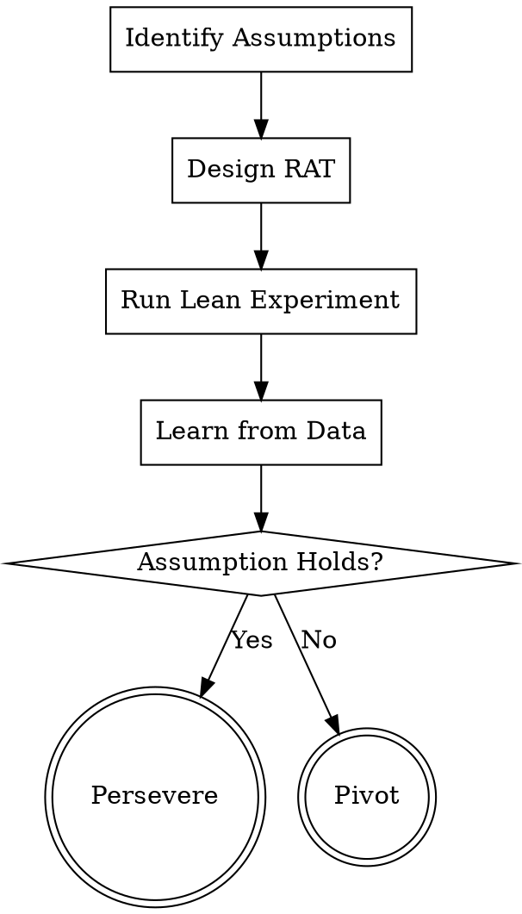

# Lean Experimentation: Lean Validation and the RAT Protocol

Experimentation is not about proving you are right, but about reducing the risk of failure through lowest-cost learning.

## Core Process: RAT (Riskiest Assumption Test)

Do not rush to build a full MVP. First identify: **"If which one assumption is proven wrong, the entire product/feature becomes meaningless?"** Design an experiment specifically for that assumption.

## Checklist

1. **List All Preconditions (Identify Assumptions)** — Covering Desirability, Feasibility, and Viability.
2. **Filter Riskiest Assumptions (Select RAT)** — Choose those with the highest uncertainty and the greatest impact on success or failure.
3. **Match MVP Type** — Refer to the "MVP Selection Matrix" below.
4. **Define Falsifiable Metrics** — A clear success/failure value must be set in advance (e.g., Click-through Rate > 15%).
5. **Execute and Log Results** — Experiment details are recorded in `docs/pmpowers/experiments/`.
6. **Decision (Pivot or Persevere)** — Decide whether to stay the course, pivot entirely, or stop the project based on evidence.

## MVP Selection Matrix

| Type | Use Case | Cost |
| --- | --- | --- |
| **Landing Page** | Validate demand authenticity and intent to click. | Extremely Low |
| **Smoke Test** | Validate if users are willing to pay for the feature or leave contact info. | Low |
| **Concierge** | Manually simulate AI or automated processes to validate service value. | Medium |
| **Wizard of Oz** | Front-end looks automated, back-end is manually operated; validates complex interaction logic. | Medium |
| **Single Feature Prototype** | Validate the usability of core functionality. | High |

## Validation Loop Logic

## Delivery Standards
Experiment reports must include: Hypothesis, MVP Description, Success Metrics, Actual Data, and Conclusion.
