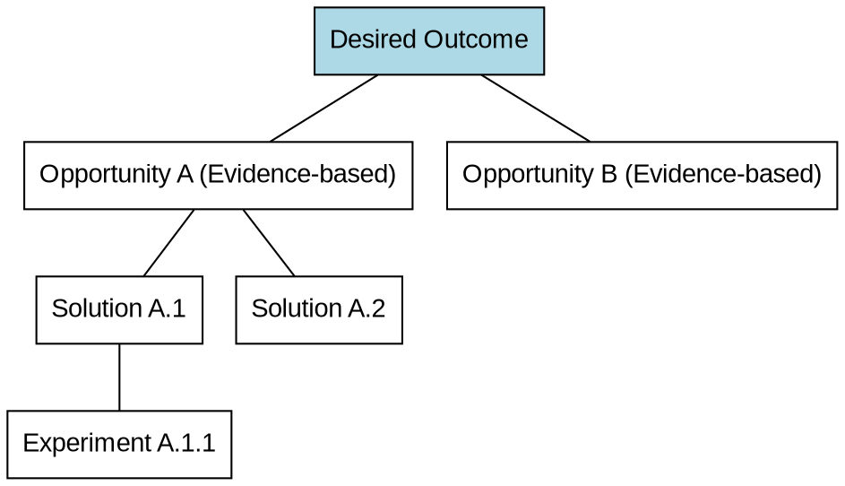

# Opportunity Mapping: Deep Guide to the Opportunity Solution Tree (OST)

Do not jump directly to solutions without solving the problem. Opportunity Mapping is a visual thinking tool that forces you to explore the "problem space" first before entering the "solution space."

## Core Framework: OST (Opportunity Solution Tree)

Opportunity Mapping structures your thinking into four levels:
1. **Outcome**: The business goal we want to achieve (derived from `north-star-metric`).
2. **Opportunities**: User pain points, needs, or desires validated through `customer-discovery`.
3. **Solutions**: Specific features or ideas to address the above opportunities.
4. **Experiments**: Lean tests to validate solution hypotheses (derived from `lean-experimentation`).

## Checklist

1. **Set Outcome** — Define a single measurable business metric. Do not pursue multiple unrelated outcomes simultaneously.
2. **Map Opportunity Space** — Based on factual evidence from research. Classify scattered user feedback into a hierarchical opportunity tree.
3. **Generate & Filter Solutions** — Propose 2-3 mutually exclusive alternative solutions for each selected opportunity, avoiding the "one-choice" trap.
4. **Identify Assumptions** — Before implementing a solution, list all desirability, feasibility, and viability assumptions that must be met for it to work.
5. **Design Experiments** — Design lean experiments for high-risk assumptions.

## Process Flow

## Expert Principles

### 1. Opportunity vs. Solution
- **Opportunity**: "It's hard for me to find the right size for me." (✅)
- **Solution**: "Build an AI size recommendation plugin." (❌) -> Always describe the problem at the opportunity level, not the feature.

### 2. Continuous Discovery
An Opportunity Map is not a one-time document; it should grow and be restructured with every `customer-discovery` interview.

### 3. Prioritization
Do not try to solve all opportunities on the tree. Choose your current focus based on "potential contribution to the Outcome" and "sufficiency of evidence."

## Anti-Patterns

- **Reverse Engineering**: Inventing an "opportunity" just to justify a feature you've already decided to build. (❌)
- **Island Branches**: A solution on the tree that cannot be traced back to any parent opportunity, or an opportunity that cannot connect to the final result. (❌)
- **Lack of Depth**: Opportunity descriptions that are too broad (e.g., "improve experience"), making it impossible to derive specific solutions.

## Delivery Standards
The structure of the Opportunity Map is recommended to be recorded via Mermaid or Dot diagrams in `docs/pmpowers/specs/opportunity-map.md`.
