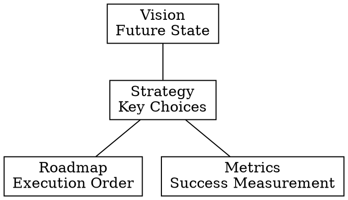

# Product Vision & Strategy: Vision and Strategic Framework

A product without strategy is just a collection of features.

## Checklist

1. **Define Product Vision** — Describe how the world will change because of your product in 3-5 years (The North Star).
2. **Develop Strategic Pillars** — Three key competitive advantages or core capabilities that support the vision.
3. **Identify Target Customers & Value Proposition (VPC)** — Clarify who you are responsible to and what core conflict you are solving.
4. **Establish Success Criteria** — How will strategic progress be quantified?

## Core Framework: Strategy Cascade

## Expert Principles

- **Strategy is Trade-offs**: If your strategy doesn't include "what we decisively will NOT do," it is not a strategy.
- **Uniqueness**: Ask "Why us? Why now?"
