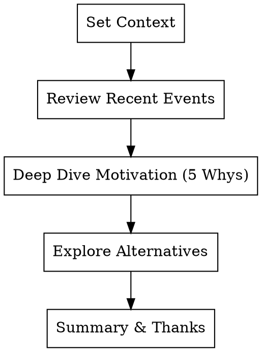

# User Interviewing: Professional Interviewing and Evidence Acquisition

Reject surface-level requests; seek the motivation behind real behaviors.

<HARD-GATE>
Before starting any interview, you must define "Interview Goals" and a "Hypothesis List." Evidence synthesis must be completed within 24 hours after the interview ends.
</HARD-GATE>

## Checklist

1. **Define Interview Goals** — What are we trying to learn through this interview? Which hypothesis are we validating?
2. **Screen Participants** — Are they in the real scenario where the problem occurs?
3. **Draft Script** — Use "The Mom Test" principles. Focus on past behavior rather than future promises.
4. **Execute & Capture** — Record key raw dialogues in `docs/pmpowers/discovery/`.
5. **Synthesize Evidence** — Extract Pains, Gains, and JTBDs.

## Interview Guidance Flow

## Red Flags (Anti-Patterns)

- **Hypothetical Questions**: "Would you use this feature?" (❌) -> Instead: "What did you do the last time you encountered this problem?" (✅)
- **Multiple Questions**: Throwing three questions at once. (❌)
- **Selling Solutions**: The interview turns into your product demo session. (❌)

## Expert Principles: JTBD Capture

Every successful interview output must answer:
- **Trigger**: What event prompted the user to start looking for a solution?
- **Friction**: What difficulties did the user encounter when trying to solve it?
- **Reward**: What does the standard for success look like in the user's mind?
